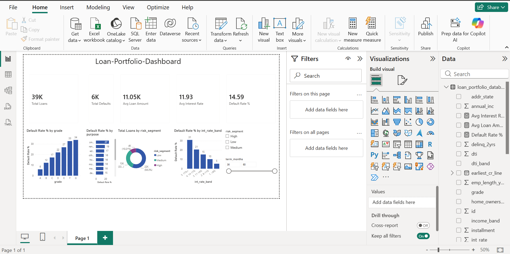

# Credit Risk Predictor — Loan Portfolio Dashboard

An end-to-end data analytics project that analyzes **39,717 LendingClub loans**
to understand **credit risk** — who defaults, and why — and presents the findings
in an interactive **Power BI** dashboard backed by **MySQL** and **SQL**.

**Stack:** Python (pandas) · MySQL · SQL · Power BI Desktop

---

## Dashboard

*Interactive Power BI dashboard: KPI cards (total loans, default rate, avg loan),
default-rate breakdowns by credit grade, loan purpose, and interest-rate band, a
High/Medium/Low risk-segment donut, and slicers for risk segment and loan term.*

---

## 1. Problem

Lenders need to know which loans are likely to **default** (be "charged off") so
they can price risk and approve wisely. This project explores a real loan
portfolio to quantify the drivers of default and turn them into a dashboard a
business user can read at a glance.

## 2. Data

- **Source:** LendingClub accepted-loans dataset (`loan.csv`), ~2007–2011.
- **Size:** 39,717 loans × 111 raw columns.
- **Target:** `loan_status` → converted to a binary **`is_default`**
  (Charged Off = 1, Fully Paid = 0). "Current" loans (outcome not yet decided)
  were excluded, leaving **38,577 finished loans**.
- A `Data_Dictionary.xlsx` describes every column. (It also references a separate
  rejected-applications file, `RejectStats`, which is not part of this project —
  we analyze funded loans only.)

## 3. Approach

1. **Explore** — profiled the file; identified the target and ~54 empty columns.
2. **Clean (`clean_loans.py`)** — dropped empty/leaky columns, fixed messy types
   (`int_rate` `"10.65%"`→`10.65`, `term` `"36 months"`→`36`, dates, employment
   length), standardized categories, handled missing values, and added analysis
   bands (income, loan amount). Output: **`loans_clean.csv`** (38,577 × 26).
   - *Leakage control:* post-outcome columns (e.g. `recoveries`, `total_pymnt`)
     were removed so the analysis reflects information available **at approval**.
3. **Build DB** — `create_table.sql` defines the `loans` table; `load_to_mysql.py`
   loads the clean CSV into MySQL (`Loan_Portfolio_Database`).
4. **Analyze (`analysis.sql`, `views.sql`)** — SQL queries for default rate by
   grade, purpose, employment length, income, loan size, interest rate, DTI,
   home ownership, and term; plus views (`vw_loans_enriched`, `vw_risk_summary`)
   that add a **High/Medium/Low risk segment** for Power BI.
5. **Visualize** — Power BI dashboard: KPI cards, default-rate breakdowns, a risk
   segmentation donut, and interactive slicers. See `POWERBI_GUIDE.md`.

## 4. Key Findings

- **Overall default rate: 14.6%** (5,627 of 38,577 finished loans).
- **Credit grade is the strongest signal.** Default climbs steadily from
  **grade A (6%)** to **grade G (34%)**. Grouped: Low (A–B) **9%**,
  Medium (C–D) **19%**, High (E–G) **29%**.
- **Loan purpose matters.** `small_business` loans are riskiest (**27%**),
  while `wedding`, `car`, and `major_purchase` are safest (**~10%**).
- **Longer terms are far riskier.** 60-month loans default at **25%** vs
  **11%** for 36-month loans.
- **Risk is priced in.** Interest rate rises with default risk: the lowest
  rate band (<8%) defaults at **5%**, the highest (17%+) at **31%**.
- Lower income and renting (vs. mortgage) are associated with modestly higher
  default rates.

## 5. Repository Contents

| File | Purpose |
|------|---------|
| `loan.csv` | Raw LendingClub dataset (input) |
| `Data_Dictionary.xlsx` | Column definitions |
| `clean_loans.py` | Cleaning script (raw → analysis-ready) |
| `loans_clean.csv` | Cleaned dataset (38,577 × 26) |
| `create_table.sql` | MySQL table definition |
| `load_to_mysql.py` | Loads clean CSV into MySQL |
| `analysis.sql` | Credit-risk analysis queries |
| `views.sql` | Power BI views (risk segment + bands) |
| `POWERBI_GUIDE.md` | Step-by-step dashboard build |
| `Credit_Risk_Dashboard.pbix` | The Power BI dashboard |

## 6. How to Reproduce

1. `python clean_loans.py` → produces `loans_clean.csv`.
2. In MySQL, run `create_table.sql` (creates the `loans` table).
3. `pip install mysql-connector-python` then `python load_to_mysql.py`
   (loads the data; expects 38,577 rows).
4. Run `views.sql`, then explore with `analysis.sql`.
5. Open `Credit_Risk_Dashboard.pbix` (or follow `POWERBI_GUIDE.md`) and
   connect Power BI to `localhost:3306` / `Loan_Portfolio_Database`.
